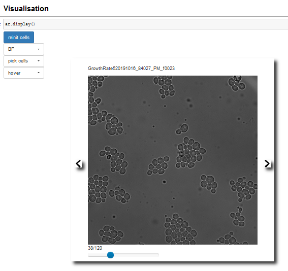
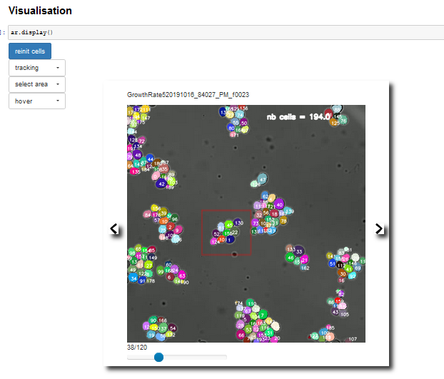

# Image analysis for the HOG1 osmotic stress experiments

## Introduction

This code has be written for analysing microfluidic HOG1 experiments. It uses *Machine Learning* segmentation
for extracting information at the single cell level.

## Installation

### Anaconda installation

Go to https://www.anaconda.com/products/individual and install Anaconda

#### Virtual environment

<details>
<summary>Creation of a virtual environment, click here to expand</summary>

in a terminal write:
```bash
conda create -n env_name python=3.7.7 anaconda
```
For activating :
```bash
conda activate env_name
```
For deactivating :
```bash
conda deactivate
```

</details>

### GPU installation :

full information for installation procedure can be found here :
[GPU support for Windows](https://shawnhymel.com/1961/how-to-install-tensorflow-with-gpu-support-on-windows/)

<details>
<summary> installation in short, Click here to expand</summary>

    Here is a summary of the different steps for the GPU installation:
    1. cuda_10.1.243_426.00_win10.exe

       can be found at https://www.filehorse.com/download-nvidia-cuda-toolkit/42676/

    2. cudnn-10.1-windows10-x64-v7.6.5.32.zip

       can be found at https://developer.nvidia.com/rdp/cudnn-archive
       In the unfolded list of Download cuDNN v7.6.5 (November 5th, 2019), for CUDA 10.1

    3. Copy 3 files from cudnn to Cuda

       - bin: Copy <cuDNN directory>\cuda\bin\*.dll to C:\Program Files\NVIDIA GPU Computing Toolkit\CUDA\vxx.x\bin
       - include : Copy <cuDNN directory>\cuda\include\*.h to C:\Program Files\NVIDIA GPU Computing Toolkit\CUDA\vxx.x\include
       - lib : Copy <cuDNN directory>\cuda\lib\x64\*.lib to C:\Program Files\NVIDIA GPU Computing Toolkit\CUDA\vxx.x\lib\x64

    4. check that you have in the environment variables those 2 paths :

       - C:\Program Files\NVIDIA GPU Computing Toolkit\CUDA\vxx.x\bin
       - C:\Program Files\NVIDIA GPU Computing Toolkit\CUDA\vxx.x\libnvvp

</details>

## Overview

The processing is done through two Jupyter notebooks.
*extract_and_process_template.ipynb* and *visu_analyse_template.ipynb* which can be found in the *notebooks/process_and_analyse* folder. 
The first one is for preparing the datasets and performing a segmentation and tracking.
The second notebook is used for producing the analyses of the experiments using the initial datasets
and both the segmentation and tracking obtained previously.

## Prepare the dataset


## Segment and track


## Analysis using the visualiser

### The Visualiser

<details>
<summary> installation in short, Click here to expand</summary>

Brigthfield

Fluorescence

Tracking


</details>

### Select the cells and produce the analysis

The analyses are done by selecting the cells to be followed and by launching the
Jupyter's cells corresponding to the desired observations.
The results are csv files. Each csv file corresponds to a given observation.
Each column of the this csv contains the values of the observation for a given cell.


## Contact

Pascal Hersen pascal.hersen@curie.fr

## License

<a rel="license" href="http://creativecommons.org/licenses/by-nc-sa/4.0/"></a><br />Ce(tte) œuvre est mise à disposition selon les termes de la <a rel="license" href="http://creativecommons.org/licenses/by-nc-sa/4.0/">Licence Creative Commons Attribution - Pas d’Utilisation Commerciale - Partage dans les Mêmes Conditions 4.0 International</a>.
